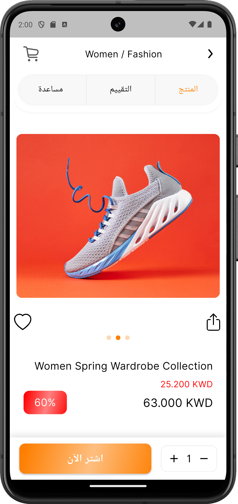
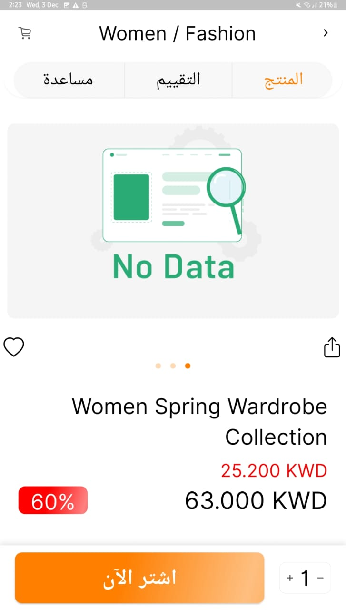
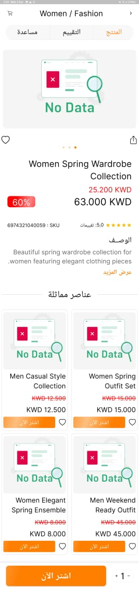

<div style="display: flex; align-items: center; gap: 10px;">
  
  <h1 style="margin: 0;">Task Orange Bay</h1>
</div>

<p>
A professional Flutter application demonstrating a clean, scalable architecture and modern UI implementation for a Product Details feature.
</p>

## 📋 Task Overview

This project implements a responsive and interactive **Product Details Page** featuring:
-   **Image Slider**: Interactive product image gallery with indicators.
-   **Product Information**: Dynamic display of product name, price (with discount logic), rating, and description.
-   **Interactive Elements**: "Show More/Less" description toggle, "Add to Cart" counter, and "Buy Now" button.
-   **State Management**: Robust state handling using **BLoC/Cubit** for loading, error, empty, and loaded states.
-   **Animations**: Smooth entrance animations and shimmer loading effects.
-   **Clean Architecture**: Separation of concerns into Domain, Data, and Presentation layers.

## 📱 Screenshots

| Product Details (Mobile) | Tablet View |
|:---:|:---:|
|  |  |

| Record Screen | Long Scroll View |
|:---:|:---:|
|  |  |

## 🛠 Architecture

This project follows **Clean Architecture** principles to ensure testability, maintainability, and scalability.

-   **Presentation Layer**: UI Widgets, Pages, and Cubits (State Management).
-   **Domain Layer**: Entities, Use Cases, and Repository Interfaces (Pure Dart, no Flutter dependencies).
-   **Data Layer**: DTOs (Data Transfer Objects), Data Sources (API/Local), and Repository Implementations.
-   **Core**: Shared utilities, constants, and dependency injection setup.

## 📦 Packages Used

Key libraries and packages used in this project:

-   **State Management**: [`flutter_bloc`](https://pub.dev/packages/flutter_bloc), [`equatable`](https://pub.dev/packages/equatable)
-   **Dependency Injection**: [`get_it`](https://pub.dev/packages/get_it), [`injectable`](https://pub.dev/packages/injectable)
-   **Networking**: [`dio`](https://pub.dev/packages/dio), [`retrofit`](https://pub.dev/packages/retrofit)
-   **Functional Programming**: [`dartz`](https://pub.dev/packages/dartz)
-   **Code Generation**: [`freezed`](https://pub.dev/packages/freezed), [`json_serializable`](https://pub.dev/packages/json_serializable)
-   **UI & Responsiveness**: [`flutter_screenutil`](https://pub.dev/packages/flutter_screenutil), [`flutter_svg`](https://pub.dev/packages/flutter_svg), [`cached_network_image`](https://pub.dev/packages/cached_network_image), [`shimmer`](https://pub.dev/packages/shimmer), [`flutter_animate`](https://pub.dev/packages/flutter_animate), [`lottie`](https://pub.dev/packages/lottie)
-   **Local Storage**: [`hive`](https://pub.dev/packages/hive)

## 📂 Folder Structure

```
lib/
├── app_assets/        # Asset path constants
├── config/            # App configuration (Routes, Themes)
├── core/              # Core utilities, constants, DI setup
├── features/          # Feature-based modules
│   └── product_details/
│       ├── data/      # Data layer (Models, Sources, Repos)
│       ├── domain/    # Domain layer (Entities, UseCases)
│       └── presentation/
│           ├── cubit/ # State management
│           ├── pages/ # Screens
│           └── widgets/ # Reusable widgets
└── main.dart          # Application entry point
```

## 🚀 How to Run

1.  **Clone the repository**:
    ```bash
    git clone https://github.com/your-username/task_orange_bay.git
    ```

2.  **Install dependencies**:
    ```bash
    flutter pub get
    ```

3.  **Generate code** (for Freeze, Injectable, Retrofit):
    ```bash
    dart run build_runner build --delete-conflicting-outputs
    ```

4.  **Run the app**:
    ```bash
    flutter run
    ```

---
*Kind Regards,*
*Ahmed Sherif*
[ahmedsherif4175@gmail.com](mailto:ahmedsherif4175@gmail.com)

